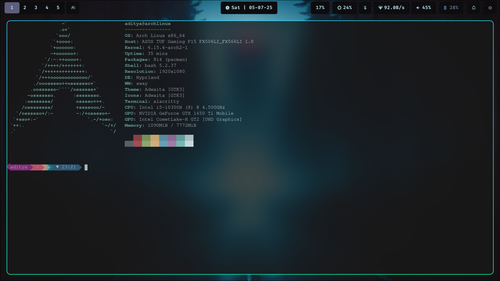
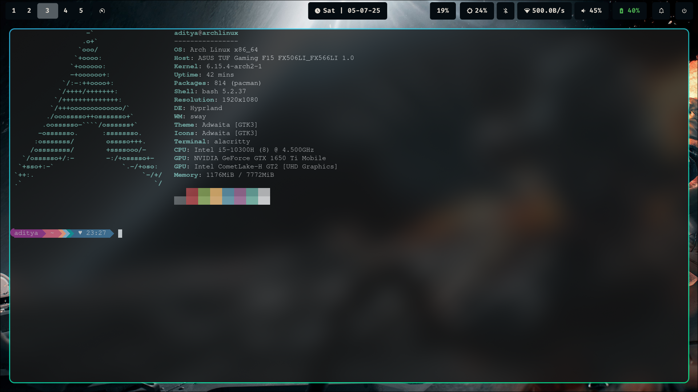
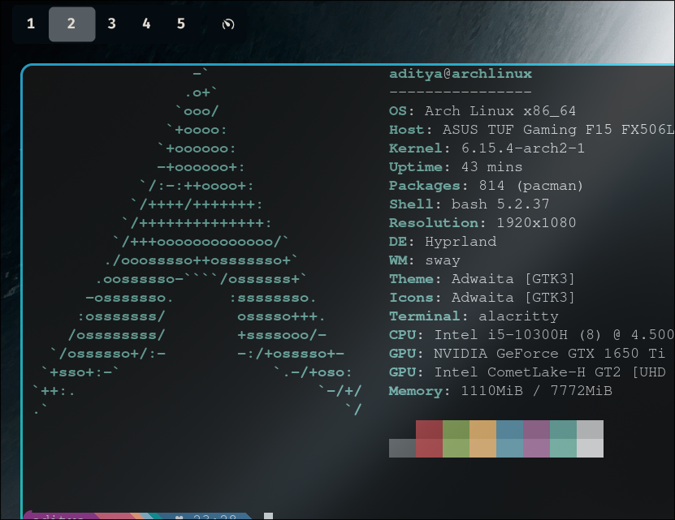
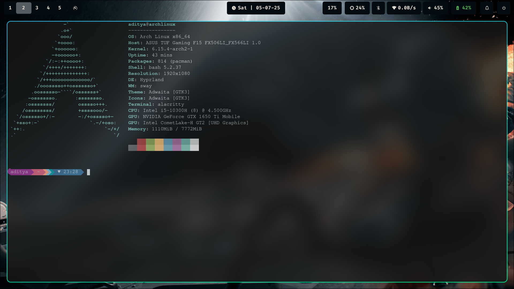
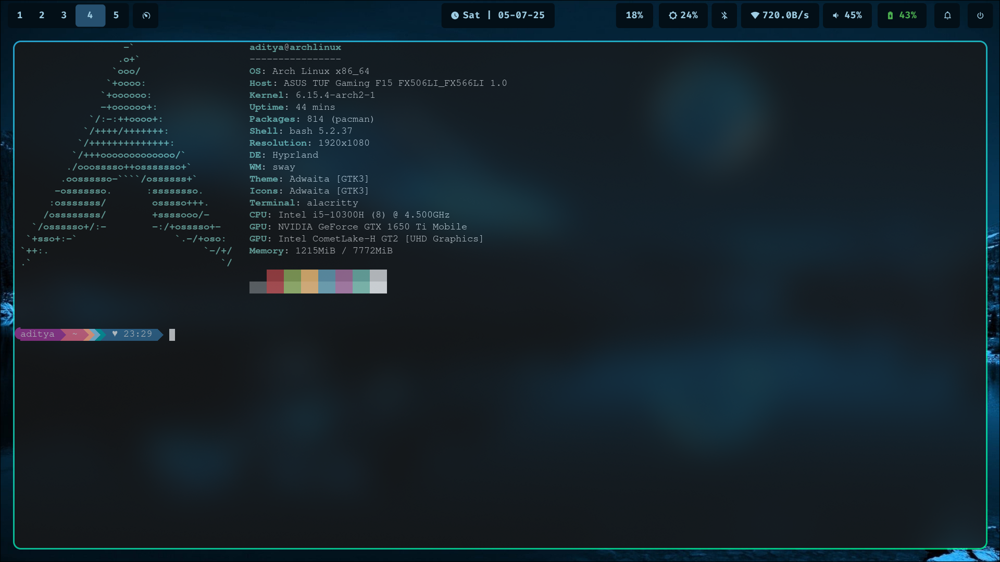

# 🌀 HyprDot

✨ My personal dotfiles for [Hyprland](https://github.com/hyprwm/Hyprland) + [Waybar](https://github.com/Alexays/Waybar), customized for a clean and minimal workflow on Wayland.

---

## 📂 Structure

```
HyprDot/
├── �️ hypr/              # Hyprland window manager config
│   └── hyprland.conf     # Main Hyprland configuration
├── 🎨 waybar/            # Status bar configuration
│   ├── config           # Waybar layout & modules
│   └── style.css        # Waybar styling & colors
├── 🔧 scripts/           # Utility scripts
│   ├── autostart.sh     # Auto-start applications
│   └── cycle_power_profile.sh # Power profile switcher
├── 📸 pics/              # Screenshots & media
│   └── *.png            # Desktop screenshots
└── 📋 README.md         # This file
```

---

## 🧠 Features

### 🎨 Visual & Theming
* ✨ Minimal, dark-themed rice with **pywal**-generated colors
* 🌈 Dynamic color schemes that adapt to your wallpaper
* 👟 Smooth animations and transitions with Hyprland
* �️ Wallpaper management handled by `swww`

### 🏗️ Interface & Navigation
* � Clean and dynamic Waybar layout with custom styling
* 🧩 Rofi used as application launcher with custom theming
* � Beautiful notifications handled by `swaync`
* ⌨️ Optimized keybindings for efficient workflow

### 🔧 System Integration
* 📶 Clickable network module with NetworkManager integration
* 🔊 Interactive audio controls with PipeWire/WirePlumber
* 🔋 Battery monitoring with charging status
* 💡 Brightness controls with `brightnessctl`
* ⚡ Power profile cycling script for performance management
* 🚀 Auto-start script for essential applications

### 🖥️ Terminal Experience
* 🎨 Oh My Posh for beautiful, customizable shell prompts
* 📊 Neofetch for stylish system information display
* ⚡ Optimized terminal workflows and productivity

---

## 📸 Screenshots

### WayBar


### Different Views
<details>
<summary>Click to see more screenshots</summary>










</details>

---

## 📅 Installation

### 🚀 Quick Setup

```bash
# Clone the repository
git clone https://github.com/Lordsofzzzz/HyprDot.git
cd HyprDot

# Backup existing configs (optional but recommended)
mkdir -p ~/.config/backup
cp -r ~/.config/hypr ~/.config/backup/ 2>/dev/null || true
cp -r ~/.config/waybar ~/.config/backup/ 2>/dev/null || true

# Install configurations
cp -r hypr ~/.config/
cp -r waybar ~/.config/

# Make scripts executable
chmod +x scripts/*.sh

# Copy scripts to a directory in your PATH (optional)
mkdir -p ~/.local/bin
cp scripts/* ~/.local/bin/

# Restart Hyprland or reload configuration
hyprctl reload
```

### 🔧 Manual Setup

If you prefer to set things up manually:

1. **Hyprland**: Copy `hypr/hyprland.conf` to `~/.config/hypr/`
2. **Waybar**: Copy `waybar/config` and `waybar/style.css` to `~/.config/waybar/`
3. **Scripts**: Make executable and place in your PATH or reference directly

---

## 🔧 Dependencies

### 🚀 Essential Components

| Package | Purpose | Installation |
|---------|---------|--------------|
| [Hyprland](https://github.com/hyprwm/Hyprland) | Window manager | `pacman -S hyprland` |
| [Waybar](https://github.com/Alexays/Waybar) | Status bar | `pacman -S waybar` |
| `swww` | Wallpaper daemon | `pacman -S swww` |
| `rofi` | Application launcher | `pacman -S rofi` |
| `swaync` | Notification daemon | `yay -S swaync` |

### 🔧 System Integration

| Package | Purpose | Installation |
|---------|---------|--------------|
| `networkmanager` | Network management | `pacman -S networkmanager` |
| `pipewire` or `wireplumber` | Audio backend | `pacman -S pipewire wireplumber` |
| `brightnessctl` | Brightness control | `pacman -S brightnessctl` |
| `jq` | JSON processing | `pacman -S jq` |
| `pywal` | Color generation | `pip install pywal` |

### 📦 Installation Commands

**Arch Linux / EndeavourOS:**
```bash
# Essential packages
sudo pacman -S hyprland waybar swww rofi networkmanager pipewire wireplumber brightnessctl jq neofetch

# AUR packages (using yay)
yay -S swaync oh-my-posh-bin

# Python packages
pip install pywal
```

**Fedora:**
```bash
sudo dnf install hyprland waybar rofi NetworkManager pipewire wireplumber brightnessctl jq python3-pip neofetch
pip install pywal
# Note: swww, swaync, and oh-my-posh may need to be built from source or installed via other methods
```

---

## ⚙️ Configuration

### 🎨 Customizing Colors

This setup uses `pywal` for dynamic theming. To change colors:

```bash
# Generate colors from wallpaper
wal -i /path/to/your/wallpaper.jpg

# Apply new colors (may require Waybar restart)
pkill waybar && waybar &
```

### 🖼️ Wallpaper Setup

```bash
# Set wallpaper with swww
swww img /path/to/wallpaper.jpg --transition-type wipe --transition-fps 60
```

### ⌨️ Key Bindings

Some useful default keybindings (check `hypr/hyprland.conf` for full list):

| Key Combination | Action |
|-----------------|--------|
| `Super + Q` | Close window |
| `Super + Return` | Open terminal |
| `Super + D` | Open Rofi launcher |
| `Super + E` | Open file manager |
| `Super + [1-0]` | Switch workspace |
| `Super + Shift + [1-0]` | Move window to workspace |

### 🔧 Scripts

- **`autostart.sh`**: Automatically starts essential services on login
- **`cycle_power_profile.sh`**: Cycles through power profiles (performance/balanced/power-saver)

### 🖥️ Terminal Customization

**Oh My Posh Setup:**
```bash
# Install a theme (example: atomic theme)
oh-my-posh init bash --config ~/.poshthemes/atomic.omp.json

# Add to your shell config (.bashrc, .zshrc, etc.)
eval "$(oh-my-posh init bash --config ~/.poshthemes/atomic.omp.json)"
```

**Neofetch:**
```bash
# Run neofetch to see system info
neofetch

# Add to shell startup for automatic display
echo "neofetch" >> ~/.bashrc
```

---

## 🎯 Recommended Tools

| Tool | Description | Why Recommended |
|------|-------------|-----------------|
| `swww` | Wallpaper daemon | Smooth transitions, low resource usage |
| `swaync` | Notification daemon | Beautiful notifications with actions |
| `pywal` | Dynamic theming | Auto-generates color schemes |
| `rofi` | Application launcher | Fast, customizable, integrates well |
| `grim` + `slurp` | Screenshot tools | Perfect for Wayland screenshots |
| `wl-clipboard` | Clipboard manager | Essential for copy/paste in Wayland |
| `thunar` or `nautilus` | File manager | GUI file browsing |
| `kitty` or `alacritty` | Terminal emulator | GPU-accelerated terminals |
| `oh-my-posh` | Terminal prompt engine | Beautiful, customizable shell prompts |
| `neofetch` | System info display | Shows system specs with style |

---

## 🐛 Troubleshooting

### Common Issues

**Waybar not starting:**
```bash
# Check for errors
waybar -l debug

# Kill existing instances
pkill waybar && waybar &
```

**Hyprland crashes:**
```bash
# Check logs
journalctl -u hyprland

# Reset to default config
cp /usr/share/hyprland/hyprland.conf ~/.config/hypr/
```

**Missing dependencies:**
```bash
# Check what's missing
which hyprland waybar rofi swww swaync
```

### 💡 Tips

- Run `hyprctl reload` to apply config changes without restarting
- Use `hyprctl monitors` to check display configuration
- Check `~/.config/hypr/hyprland.log` for detailed logs

---

## 🤝 Contributing

Contributions are welcome! Here's how you can help:

1. 🐛 **Report bugs** - Open an issue with detailed information
2. � **Suggest features** - Share your ideas for improvements
3. 📝 **Improve docs** - Help make the README even better
4. 🔧 **Submit PRs** - Fix bugs or add new features

### 📋 Pull Request Guidelines

- Test your changes thoroughly
- Update documentation if needed
- Follow existing code style
- Include screenshots for visual changes

---

## �📃 License

MIT License - Feel free to use, modify, or fork. Credit appreciated! ❤️

---

## 🙏 Acknowledgments

- [Hyprland Team](https://github.com/hyprwm/Hyprland) - Amazing Wayland compositor
- [Waybar Team](https://github.com/Alexays/Waybar) - Excellent status bar
- [r/unixporn](https://reddit.com/r/unixporn) - Inspiration and community

---

<div align="center">

**⭐ If you found this helpful, please give it a star! ⭐**

💻 *Built with love on Arch Linux + Hyprland*

[](https://github.com/Lordsofzzzz/HyprDot/stargazers)
[](https://github.com/Lordsofzzzz/HyprDot/network)

</div>
