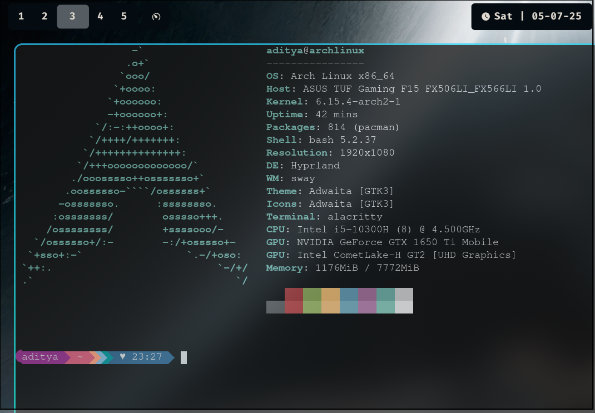

# 🌀 HyprDot

✨ My personal dotfiles for [Hyprland](https://github.com/hyprwm/Hyprland) + [Waybar](https://github.com/Alexays/Waybar), customized for a clean and minimal workflow on Wayland.

---

## 📂 Structure

```
HyprDot/
🖜 hypr/       # Hyprland configuration
🖜 waybar/     # Waybar configuration
```

---

## 🧠 Features

* 🎨 Minimal, dark-themed rice with **pywal**-generated colors
* 💡 Clean and dynamic Waybar layout
* 📶 Clickable network + audio modules
* 🔋 Battery + Brightness support
* 👟 Smooth animations with Hyprland
* 🧩 Rofi used as application launcher
* 🖼 Wallpaper handled by `swww`
* 🔔 Notifications handled by `swaync`

---

## 📸 Screenshots

### Main Desktop


### Different Views
<details>
<summary>Click to see more screenshots</summary>





</details>

---

## 📅 Installation

```bash
git clone https://github.com/Lordsofzzzz/HyprDot.git
cd HyprDot

cp -r hypr ~/.config/
cp -r waybar ~/.config/

# Restart Hyprland
```

---

## 🔧 Dependencies

Make sure you have these installed:

* [Hyprland](https://github.com/hyprwm/Hyprland)
* [Waybar](https://github.com/Alexays/Waybar)
* `swww` (wallpaper daemon)
* `rofi` (used as app launcher)
* `swaync` (notification daemon)
* `networkmanager` (for network control)
* `wireplumber` or `pipewire` (audio backend)
* `brightnessctl` (for brightness module)
* `jq` (used in some Waybar scripts)
* `pywal` (for color generation)

---

## 🎯 Recommended Tools

| Tool     | Description            |
| -------- | ---------------------- |
| `swww`   | Wallpaper daemon       |
| `swaync` | Notification daemon    |
| `pywal`  | Dynamic theming engine |
| `rofi`   | Application launcher   |

---

## 📃 License

MIT License
Feel free to use, modify, or fork. Credit appreciated. ❤️

---

> 💻 Built with love on Arch Linux + Hyprland
