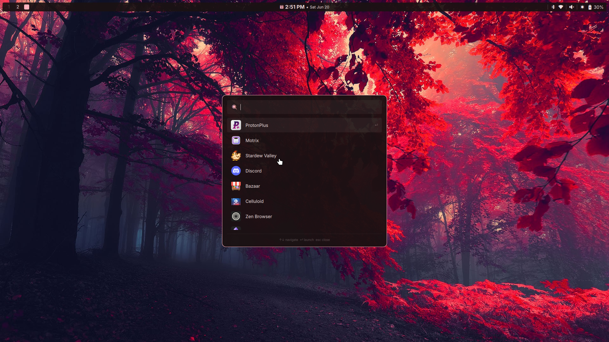
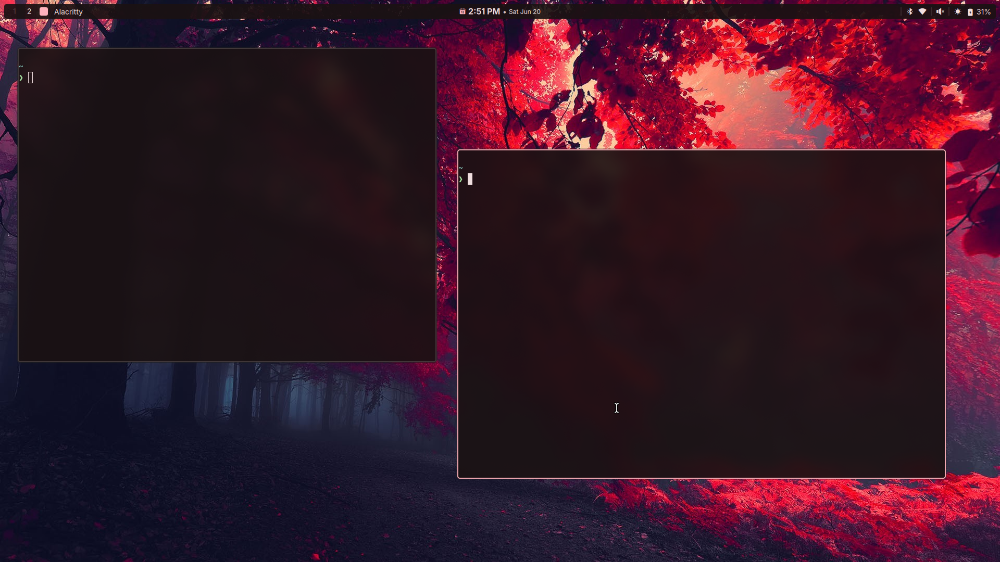
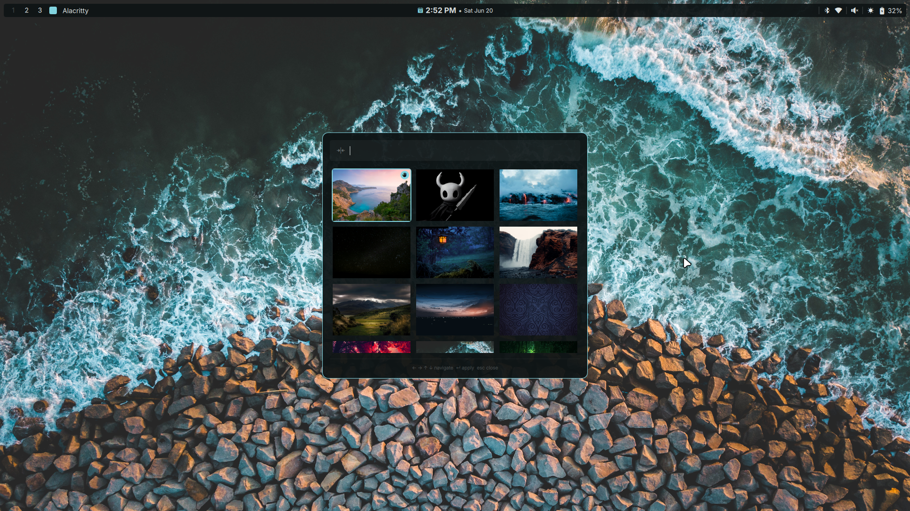
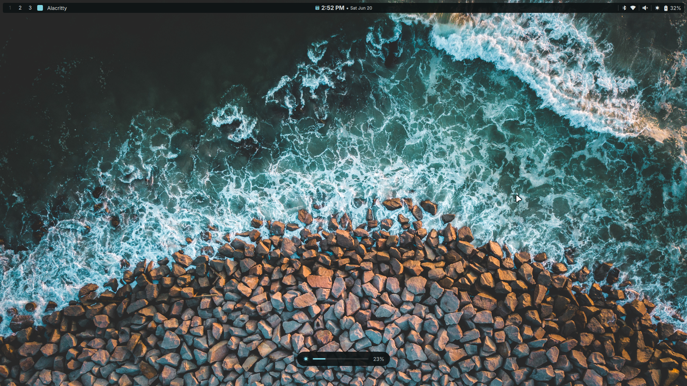
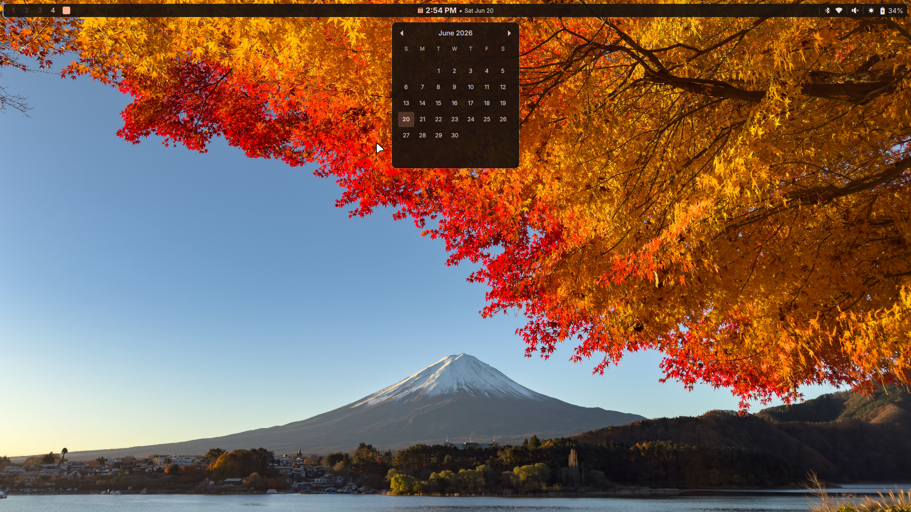
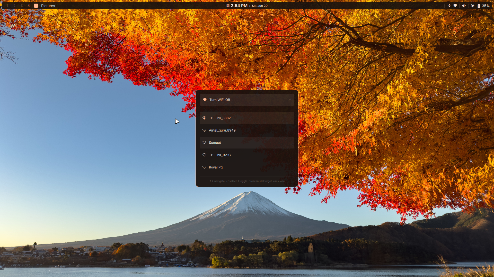
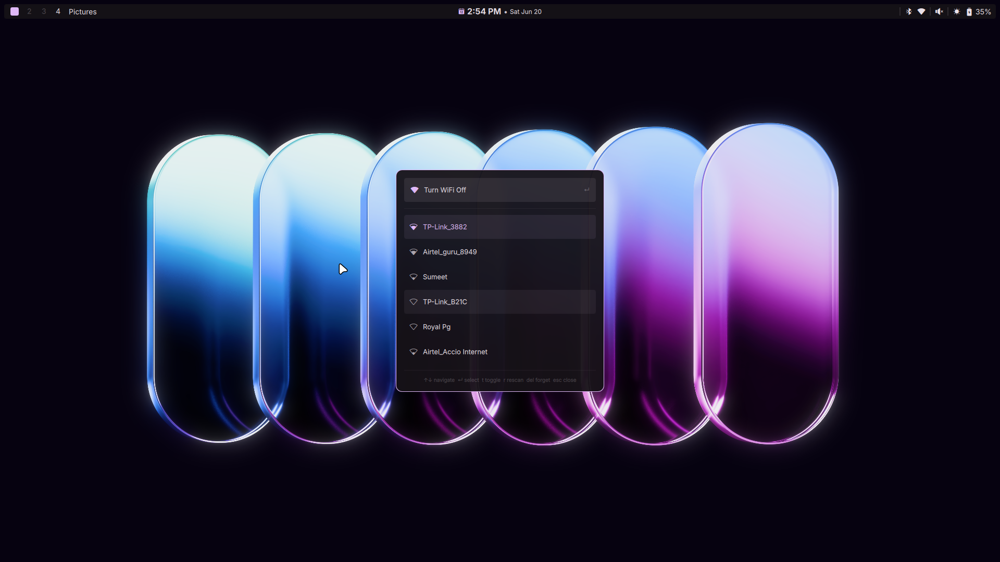
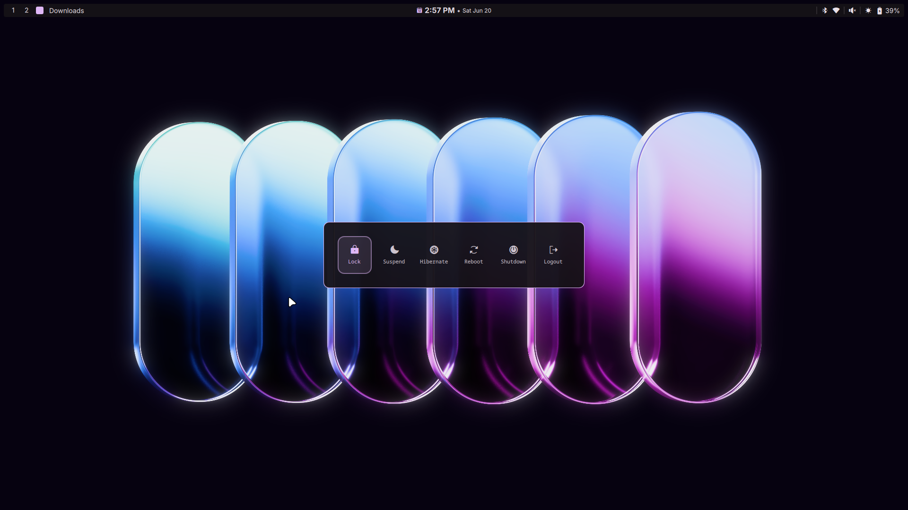

# HyprDot

Hyprland dotfiles — the repo lives directly at `~/.config`, no symlink manager needed.

## Screenshots

<p align="center">
  
  
  
</p>
<p align="center">
  
  
  
</p>
<p align="center">
  
  
  
</p>

## Prerequisites

- [Hyprland](https://hyprland.org/) (0.55+ for Lua API) — Wayland compositor
- [Quickshell](https://quickshell.org/) — Qt-based Wayland shell (bar, launcher, system tray)
- [Alacritty](https://alacritty.org/) — terminal emulator
- [matugen](https://github.com/InioX/matugen) — Material You color generation from wallpaper
- [swaybg](https://github.com/swaywm/swaybg) — wallpaper display
- [grim](https://sr.ht/~emersion/grim/) + [slurp](https://github.com/emersion/slurp) — screenshots
- [wpctl](https://github.com/PipeWire/wireplumber) — audio control
- [brightnessctl](https://github.com/Hummer12007/brightnessctl) — backlight control
- [playerctl](https://github.com/altdesktop/playerctl) — MPRIS media control
- A [Nerd Font](https://www.nerdfonts.com/) (e.g. FiraCode Nerd Font)

## Install

Clone into `~/.config`:

```bash
git clone git@github.com:Lordsofzzzz/HyprDot.git ~/.config
```

## Workflow

```bash
# Edit configs directly
vim ~/.config/quickshell/Launcher.qml

# Commit changes
cd ~/.config
git add .
git commit -m "change something"
git push
```

Or deploy individual directories with GNU Stow:

```bash
stow hypr        # Hyprland compositor config
stow alacritty   # Terminal config
stow quickshell  # Wayland shell (bar, launcher, wifi panel)
stow matugen     # Material You theming config
stow gtk-3.0     # GTK3 colors.css import
stow gtk-4.0     # GTK4 colors.css import
```

## What's included

### `hypr/`

Hyprland compositor config in Lua (revived API, not the legacy `hyprlang` format):

- `hyprland.lua` — main entrypoint; `require()`s all modules, `dofile()`s generated colors
- `monitors.lua` — display config (auto-detect, preferred mode, scale 1.0)
- `settings.lua` — core compositor settings (gaps, borders, blur, VRR, cursor, input, NVIDIA workarounds)
- `curves.lua` — 5 bezier curves + 1 spring curve for animations
- `animations.lua` — 18 animation entries (windows, fade, layers, workspaces)
- `keybinds.lua` — all keyboard shortcuts via `hl.bind()` + `hl.dsp.*` API
- `window-rules.lua` — window rules (suppress-maximize, fix xwayland drags, float hyprland-run)
- `autostart.lua` — one-shot startup: launches Quickshell on `hyprland.start`
- `hyprland-colors.lua` — dynamic border colors, generated by matugen (not committed)

### `quickshell/`

Custom Wayland shell with system integration. Entry point: [`shell.qml`](quickshell/shell.qml)

```
quickshell/
├── shell.qml              # entry point — wires everything together
├── Bar.qml                # per-screen panel window (anchored top bar)
├── Colors.qml             # generated color singleton (matugen, not committed)
├── Config.qml             # hardcoded singleton (spacing, fonts, maxNotifications)
├── Launcher.qml           # app launcher overlay (SUPER+D)
├── PowerMenu.qml          # power overlay — lock/suspend/hibernate/reboot/shutdown (SUPER+L)
├── WallpaperPicker.qml    # wallpaper grid browser with search (SUPER+SHIFT+W)
├── Wifi.qml               # WiFi manager overlay (SUPER+W)
├── CalendarPopup.qml      # month grid calendar overlay (ALT+C)
├── services/
│   └── BrightnessService.qml  # brightness singleton — udev monitor
└── components/
    ├── Workspaces.qml     # workspace indicators — dynamic visibility
    ├── WindowTitle.qml    # active Hyprland window title
    ├── ClockWidget.qml    # date/time display — click to open calendar
    ├── AudioWidget.qml    # PipeWire volume icon + percentage
    ├── MicMuteWidget.qml  # mic mute indicator (hidden when unmuted)
    ├── BatteryWidget.qml  # UPower battery with charge thresholds
    ├── BacklightWidget.qml# brightnessctl read/write + udev monitor (scroll to adjust)
    ├── BluetoothWidget.qml# adapter state icon (on/connected/off)
    ├── NetworkWidget.qml  # Wi-Fi / ethernet status icon
    ├── Osd.qml            # on-screen display for volume, mic, brightness
    └── NotificationPopup.qml # notification manager with DND (per-screen)
```

Color values are exposed via a generated singleton `Colors.qml` (regenerated by matugen on wallpaper change). The OSD is triggered automatically via Pipewire (`VolumeChanged`, `MutedChanged`) for volume/mute/mic, and via `BrightnessService.changed` (udev monitor) for brightness.

**`PowerMenu.qml`** — full-screen overlay with lock, suspend, hibernate, reboot, shutdown, logout. Two-step confirmation for destructive actions. Keyboard-driven (arrows, Enter, Escape).

**`WallpaperPicker.qml`** — grid browser scanning `~/Pictures/wallpapers`. Thumbnails loaded async, search bar filters filenames. Applies via chain: `pkill swaybg` → `swaybg` → `matugen` → `hyprctl reload`. Keyboard-navigable.

### `alacritty/`

Terminal config with Catppuccin Mocha ANSI palette and a Material You background/foreground (generated by matugen).

### `matugen/`

Material You theming engine — maps templates to output files:

| Template | Generates |
|---|---|
| `templates/quickshell.qml` | `~/.config/quickshell/Colors.qml` |
| `templates/alacritty.toml` | `~/.config/alacritty/alacritty.toml` |
| `templates/hyprland-colors.lua` | `~/.config/hypr/hyprland-colors.lua` |
| `templates/gtk-colors.css` | `~/.config/gtk-3.0/colors.css` + `~/.config/gtk-4.0/colors.css` |

### `gtk-3.0/`

Contains `gtk.css` that imports the generated `colors.css`. The `colors.css` file (output by matugen) defines libadwaita/GTK named colors — accent, window, headerbar, popover, view, and card surfaces. matugen's post-hook also applies the GTK theme via `gsettings set org.gnome.desktop.interface gtk-theme adw-gtk3-{{mode}}`.

> **Note:** `gtk-4.0/` is live-only (generated by matugen), not tracked in the repo.

### `uwsm/`

Systemd user session environment variables sourced by `uwsm`:
- NVIDIA driver vars (`LIBVA_DRIVER_NAME=nvidia`, `__GLX_VENDOR_LIBRARY_NAME=nvidia`, `GBM_BACKEND=nvidia-drm`)
- Qt platform theme (`QT_QPA_PLATFORMTHEME=gtk3`)
- Cursor sizes (`XCURSOR_SIZE=24`, `HYPRCURSOR_SIZE=24`)

---

Regenerate colors after changing wallpaper:

```bash
matugen image ~/path/to/wallpaper --source-color-index 0
```

Then reload Hyprland and restart Quickshell for all changes to take effect.

## Keybinds

SUPER is the Windows/Mod4 key.

| Key | Action |
|---|---|
| `SUPER+Return` | Open Alacritty |
| `SUPER+Q` | Close focused window |
| `SUPER+D` | Toggle launcher |
| `SUPER+F` | Toggle fullscreen |
| `SUPER+E` | Open Nautilus |
| `SUPER+SHIFT+Q` | Logout |
| `SUPER+W` | Toggle WiFi panel |
| `SUPER+SHIFT+W` | Toggle wallpaper picker |
| `SUPER+L` | Toggle power menu |
| `ALT+C` | Toggle calendar popup |
| `SUPER+S` | Toggle scratchpad (special workspace "magic") |
| `SUPER+SHIFT+S` | Move window to scratchpad |
| `SUPER+V` | Toggle float |
| `SUPER+P` | Pseudo-tile |
| `SUPER+J` | Toggle split |
| `SUPER+1..0` | Switch to workspace N |
| `SUPER+SHIFT+1..0` | Move window to workspace N |
| `Print` | Full screenshot |
| `SUPER+Print` | Region screenshot |
| `SHIFT+Print` | Active monitor screenshot |
| `SUPER+arrow` | Focus direction |
| `SUPER+mouse_down` | Next workspace |
| `SUPER+mouse_up` | Previous workspace |
| `SUPER+click` | Drag window |
| `SUPER+right-click` | Resize window |
| `XF86AudioLowerVolume` / `RaiseVolume` / `Mute` | Volume control |
| `XF86AudioPlay` / `Pause` / `Next` / `Prev` | Media playback (playerctl) |
| `XF86MonBrightnessDown` / `Up` | Backlight control |

